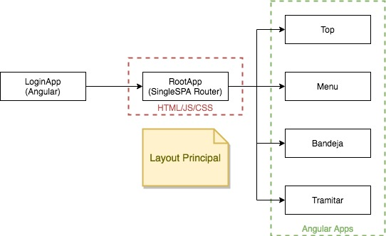
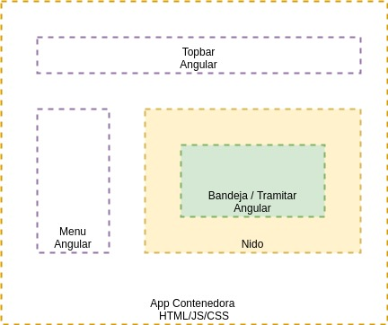

# MultiplesSPAs

Ejemplo de uso de single-spa-js y single-spa-layout con aplicaciones angular

## Diagrama de Arquitectura

### Layout aplicación root

## Tecnologías

- Angular 8
- single-spa-layout: "^1.0.0-beta.2"
- single-spa: "^5.3.1"
- webpack: "^4.41.2"
- webpack-cli: "^3.3.10"
- webpack-config-single-spa-ts": "^1.4.2"
- Node 12.13.1
- Npm 6
